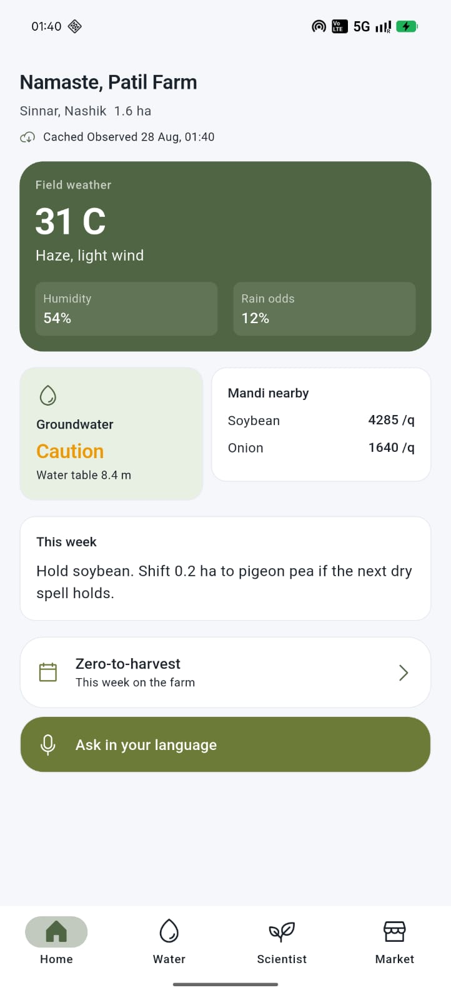
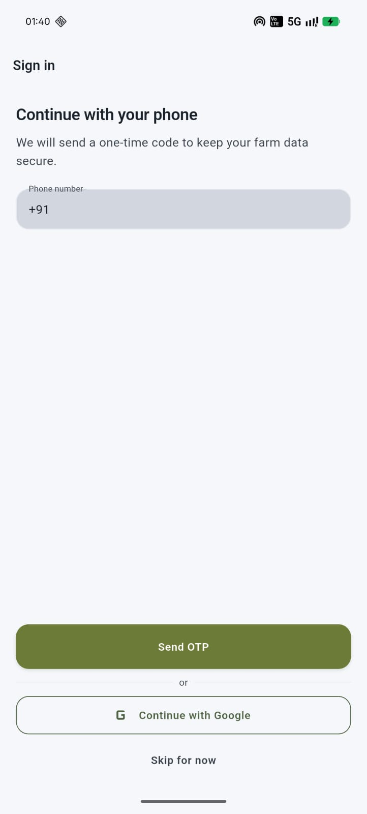
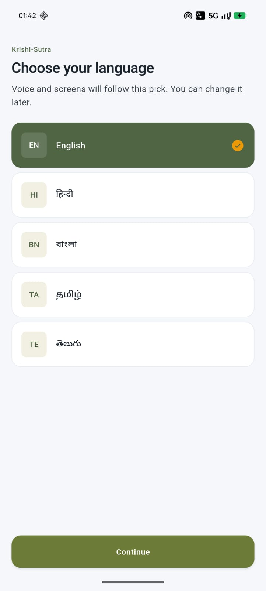
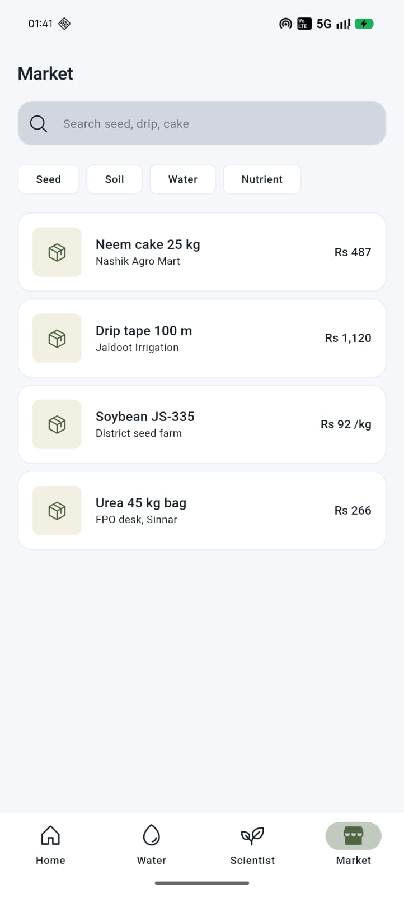
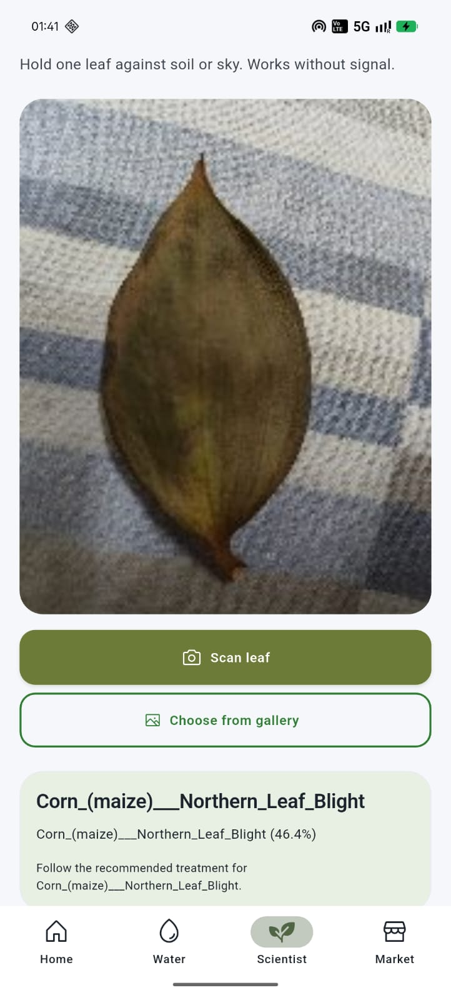
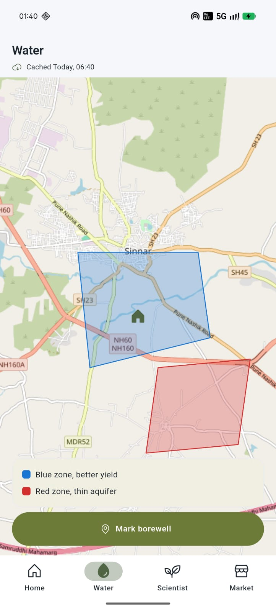

<p align="center">
  
</p>

<h1 align="center">Krishi Sutra</h1>

<p align="center"><strong>An offline-first agriculture intelligence platform for Indian farmers.</strong></p>

<p align="center">
  <a href="https://github.com/topics/flutter"></a>
  <a href="https://dart.dev/"></a>
  <a href="LICENSE"></a>
  <a href="https://github.com/SaswatBalyan/AgroSense-KrishiSutra"></a>
  <a href="https://github.com/SaswatBalyan/AgroSense-KrishiSutra"></a>
  <a href="https://github.com/SaswatBalyan/AgroSense-KrishiSutra"></a>
</p>

<p align="center">
  Krishi Sutra brings weather, mandi prices, groundwater, crop advice and on-device
  disease detection into one app that keeps working after the network drops.
</p>

---

## Screenshots

<table align="center">
<tr>
<td align="center"><br><em>Dashboard</em></td>
<td align="center"><br><em>Sign in</em></td>
<td align="center"><br><em>Language</em></td>
</tr>
<tr>
<td align="center"><br><em>Marketplace</em></td>
<td align="center"><br><em>Pocket Scientist</em></td>
<td align="center"><br><em>Water Compass</em></td>
</tr>
</table>

## Features

**Dashboard & weather** — live temperature, humidity and rain chance, groundwater status, and today's market prices rendered from the local cache the moment the app opens.

**Marketplace & mandi prices** — live Agmarknet rates in ₹/quintal with daily deltas, plus a searchable catalog of seed, soil, water and nutrient products.

**Water Compass** — an interactive map of groundwater prospects; pin a location to inspect the recorded depth and status for that spot.

**Pocket Scientist** — on-device crop disease detection running a TensorFlow Lite model on the phone itself, covering 38 classes across apple, corn, grape, peach, pepper, potato, strawberry and tomato. No internet required.

**AI Assistant** — a voice-first assistant with offline dictation (Vosk) and cloud replies (Groq LLaMA 3.1) when connected. Conversation history persists in a local database.

**Crop roadmap** — a weekly calendar of farm tasks regenerated around your crop, with local notifications and side effects that survive re-planning.

**Localized for Indian farmers** — English, हिन्दी, বাংলা, मराठी, தமிழ் and తెలుగు.

## Offline-first, by design

Every screen reads from a local Drift (SQLite) database first. A sync queue tracks changes and a background `Workmanager` task reconciles with Appwrite every six hours when a connection is available. Weather and market price refreshes respect cache freshness and the app degrades gracefully to clean empty states, never errors, when the network is gone.

## Tech stack

| Area | Choice |
| --- | --- |
| Framework | Flutter 3.32 · Dart ^3.8.1 |
| State & routing | Riverpod 2.6 · go_router 17 |
| Local data | Drift (SQLite) · sync queue · Workmanager |
| Backend | Appwrite 26 (auth, collections, reconciliation) |
| AI | Groq (LLaMA 3.1 8B) · TensorFlow Lite · Vosk speech |
| Data sources | Agmarknet mandi prices · OpenWeather |
| Maps | flutter_map · latlong2 |
| Notifications | flutter_local_notifications · timezone |

## Getting started

**Prerequisites:** Flutter 3.x with the Dart SDK (project targets `^3.8.1`), and a device or emulator.

```bash
git clone https://github.com/SaswatBalyan/AgroSense-KrishiSutra.git && cd krishi_sutra
flutter pub get
flutter run            # runs in offline/demo mode with zero keys
```

The app is fully usable without any API keys: bundled models, cached data and mock farm data cover the demo path.

### Enabling live data

Copy the launcher template to a git-ignored file and fill in your keys:

```powershell
Copy-Item run_dev.ps1.example run_dev.ps1
```

Or pass keys directly to the build with `--dart-define`:

| Define | Service | Required for |
| --- | --- | --- |
| `WEATHER_API_KEY` | OpenWeather | Dashboard weather card |
| `AGMARKNET_API_KEY` | Agmarknet (data.gov.in) | Live mandi prices |
| `GROQ_API_KEY` | Groq | AI Assistant cloud replies |
| `APPWRITE_ENDPOINT` `APPWRITE_PROJECT_ID` `APPWRITE_DATABASE_ID` | Appwrite | Auth, sign-in and cloud sync |
| `APPWRITE_*_COLLECTION_ID` | Appwrite | Collection routes per entity |

The first launch of the AI Assistant downloads a small speech model over the network (once); the Hindi model ships bundled in `assets/models/vosk`.

## Project structure

```
krishi_sutra
├── lib
│   ├── core            # theme, navigation, constants
│   ├── data
│   │   ├── local       # drift tables, DAOs, sync queue
│   │   ├── remote      # appwrite, agmarknet, openweather, mappers
│   │   └── repositories
│   ├── features        # ai_assistant · auth · dashboard · marketplace
│   │                   # onboarding · pocket_scientist · roadmap · water_compass
│   ├── l10n            # 6 generated localizations
│   └── shared          # providers, widgets
├── assets
│   ├── models          # crop_disease_v1.tflite · labels · vosk
│   └── logo.jpeg
├── screenshots
├── scripts             # dev-only maintenance tools (not in app build)
└── test / test_assets  # unit, widget and integration fixtures
```

## Testing

```bash
flutter test
```

27 tests cover repositories, DAOs, sync and reconciliation mappers, weather parsing, TFLite inference guards and the router. Run static analysis with:

```bash
flutter analyze --no-fatal-infos
```

## License

Released under the [MIT License](LICENSE). © 2026 Saswat Balyan © @Namaha-51 / Naman Agarwal.
